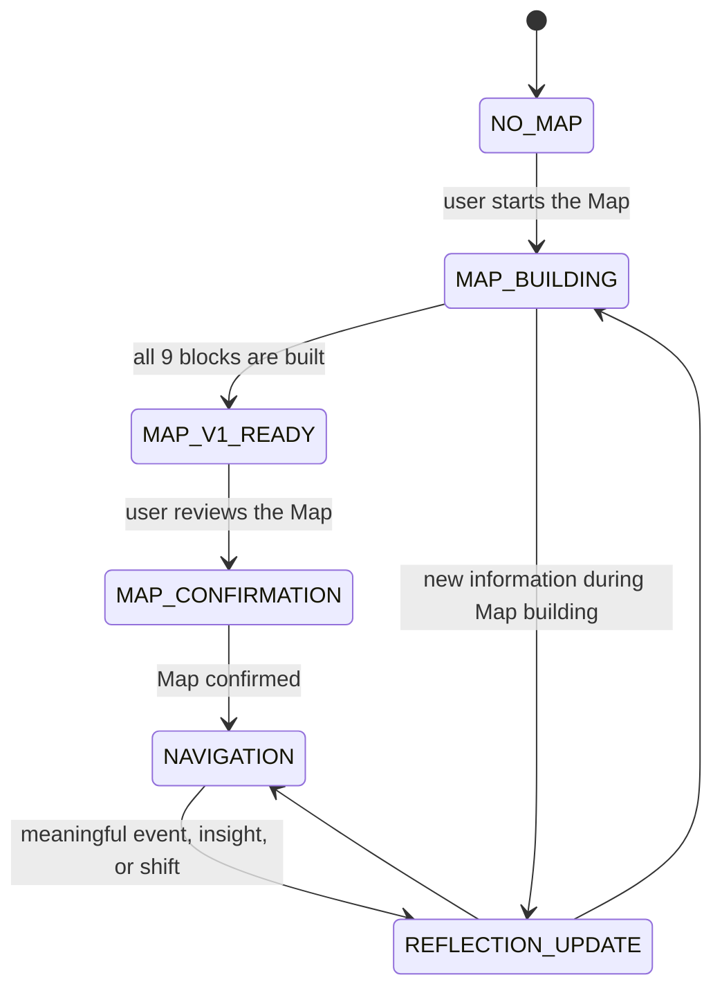

<p align="center">
  
</p>

# Personal Navigator

<p align="center">
  <a href="https://dimak-pro.github.io/personal-navigator/#en"></a>
  <a href="docs/INSTALLATION.en.md"></a>
  <a href="docs/QUICKSTART.en.md"></a>
  <a href="README.md"></a>
</p>


**Personal Navigator** is an open-source personal AI navigation system packaged as a skill. It first helps a person understand themselves more deeply, then uses that understanding to give more honest and relevant answers.

A regular AI assistant can quickly give advice, a plan, or a motivational line. But if it does not know the person — their values, energy, fears, desires, experience, and current life stage — its answer often stays too generic. Personal Navigator works differently: it helps build a living Personality Map, keeps long-term development memory, and then uses that context for decisions, reflection, goals, states, and difficult life questions.

I call the main orientation of this system **inner Fire** or **Living Fire**. This is not an esoteric concept. It means the state where a person feels again: I am living my life, with pleasure, drive, energy, meaning, and movement in harmony with my nature. Different people may name this differently. The name is not the point; the state is.

This is not another productivity bot or a set of motivational prompts. Personal Navigator does not try to make a person merely more efficient. It helps the person become clearer, freer, more alive, and more aligned with their own nature.

[Русский](README.md) · [Landing](https://dimak-pro.github.io/personal-navigator/#en) · [Install](docs/INSTALLATION.en.md) · [How to work after installation](docs/QUICKSTART.en.md) · [Skill package](personal-navigator-skill/)

Recommended GitHub repository name: `personal-navigator`. The installable skill package inside the repository is `personal-navigator-skill/`.

## New User Route

1. Open the [Personal Navigator landing page](https://dimak-pro.github.io/personal-navigator/#en) to understand the idea and user journey.
2. Create a dedicated project folder for your Navigator. This is where the skill, `AGENTS.md`, and your private memory files will live.
3. Go to the [installation guide](docs/INSTALLATION.en.md) and copy the commands for your agent environment.
4. After installation, open [how to work after installation](docs/QUICKSTART.en.md): it has the first prompt and memory-file checks.
5. If you already understand agent skills, use [`personal-navigator-skill/`](personal-navigator-skill/) directly.

If you open `docs/index.html` inside GitHub, GitHub will show the page source. The rendered Pages version is here: [https://dimak-pro.github.io/personal-navigator/](https://dimak-pro.github.io/personal-navigator/#en).

## Why It Exists

Most people do not need more information. They need clarity.

Generic AI often answers as if the person is already understood: it gives advice, plans, techniques, and frameworks. But without deep personal context, even reasonable answers can miss what matters: values, energy, maturity, life circumstances, real desires, constraints, and repeated patterns.

Personal Navigator follows a different logic:

```text
not advice -> but understanding the person
not motivation -> but clarity and inner support
not universal recommendation -> but navigation through a Personality Map
not a one-off answer -> but living development memory
```

The main goal is to help a person gradually move toward a life that matches their deeper nature.

In practice, after the Map is built and confirmed, the person gets more than a "bot with a prompt." They get a personal workspace:

- the agent knows the current stage of the process;
- it has a Personality Map that the user has reviewed and confirmed;
- it remembers meaningful events, decisions, shifts, and repeated themes;
- it records gaps and hypotheses instead of pretending everything is known;
- every new chat inside that folder continues the same development process.

## Living Fire

**Living Fire** is the primary compass of the methodology.

It is the state where:

- energy arises naturally;
- actions feel meaningful;
- choices match inner values;
- abilities are expressed;
- the person accepts responsibility for their life;
- life feels alive and real.

Personal Navigator does not optimize a person for efficiency at the cost of aliveness. If a recommendation increases productivity but reduces aliveness, it is wrong for this methodology.

## How It Works

The skill follows a clear lifecycle:



The simple internal logic is:

```text
dedicated project folder
-> the agent reads AGENTS.md and understands this is Personal Navigator
-> it checks NAVIGATOR_STATE.md and sees the current stage
-> it builds or reads the Personality Map
-> it checks conclusions against real examples, energy, and the current situation
-> it writes insights, decisions, gaps, and updates back into memory
```

That is why the Navigator should not start from zero every time. It works as a personal orientation system that lives in one folder and gradually becomes more accurate.

### 1. No Map, No Full Navigation

If the user does not yet have a Personality Map, the Navigator says so honestly: full personalization is not available yet. It can still help in the moment, but the answer must be provisional.

The agent must not pretend to deeply know the person.

### 2. The Map Is Built Through Friendly Interview

The Navigator does not run a dry questionnaire. It asks one strong question at a time and extracts real examples, choices, reactions, desires, fears, values, and repeated life patterns.

Sometimes the user does not come to "build a Map"; they come with a real question. If the Navigator lacks the context needed for an honest answer, it asks the missing question, helps with the current situation, and uses the answer to enrich the Map.

### 3. Building the Map Already Creates Value

The process of creating the Map is part of the methodology. Simple questions often become deep: the person has to honestly remember real situations, choices, energy, repeated scenarios, and what genuinely makes them feel alive.

The Navigator does not copy direct answers into the Map. It uses answers as anchors, then carefully interprets them: connecting facts, contradictions, values, energy, and patterns into one coherent picture of the person. The finished Map should read not like a questionnaire, but like a living portrait assembled piece by piece.

### 4. Full Navigation Starts After Map Confirmation

When all 9 blocks have been built to working depth and the user confirms that the Map is accurate enough, the Navigator can rely on:

- the Personality Map;
- current energy level;
- life circumstances;
- development history;
- unresolved hypotheses;
- past decisions and repeated themes;
- scientific models as lenses, not labels;
- principles from books as an external compass, not dogma.

## User Journey

After installation, the person should not have to figure out how to use the Navigator correctly. The skill should guide them through the process.

1. **First contact.** The Navigator explains that full personal navigation requires a Personality Map and briefly shows why the Map matters.
2. **Memory creation.** If memory files do not exist yet, the Navigator creates or offers ready-to-save versions of `NAVIGATOR_STATE.md`, `PERSONALITY_MAP.md`, `DEVELOPMENT_JOURNAL.md`, and `OPEN_LOOPS.md`.
3. **Friendly interview.** The Navigator starts with simple human questions. This is not a form or interrogation: the questions help the person remember real situations and notice energy, choices, desires, limits, and recurring themes.
4. **Progress without pressure.** During the process, the Navigator gently shows which Map blocks are already filled, which are still weak, and what next question will move things forward.
5. **Help before the full Map.** If the person brings a real request before the Map is complete, the Navigator does not refuse. It says honestly that the answer will be limited, asks the missing questions, and uses the conversation to enrich the Map.
6. **First Map V1.** When all 9 blocks are built, the Navigator rereads the material, checks contradictions, moves uncertainty into open loops, and gives the first coherent Map version. The person should read it carefully: this moment often brings strong clarity and inner support.
7. **Map confirmation.** The Navigator asks what feels accurate, surprising, not true, missing, or weak. Until important corrections are handled, the Map remains `pending`.
8. **Living navigation.** After the Map is confirmed, full work begins: decisions, goals, states, Ikigai, WOOP, reflection, journal updates, and careful Map development as the person changes.

Main principle: the Navigator should help the person move through this path calmly and with interest. It should not pressure, rush, or turn self-reflection into a heavy obligation.

## Personality Map

The Personality Map is the central instrument of the system. It is not a permanent "truth about the person." It is a living model that is continually refined through dialogue, observation, and reflection.

The Map has 9 blocks:

| Block | What It Reveals |
| --- | --- |
| 1. Core of Personality | values, drivers, conscience, shadows, natural strategy |
| 2. Psycho-Energetic Profile | energy sources, drains, cycles, recovery, environments |
| 3. Living Fire Element | aliveness, play, humor, speech, resonance with people |
| 4. Psychotype and Scientific Models | MBTI, Big Five, HEXACO, Enneagram, and other models as approximations |
| 5. Way of Action | how the person decides, moves, fails, and returns to strength |
| 6. Social Self | roles, relationships, boundaries, contribution, social resonance |
| 7. Experience and Capital | skills, achievements, mistakes, assets, lived material |
| 8. Future and Goals | direction, Ikigai, scenarios, desires, constraints, meaning |
| 9. Personality Metrics and Quality of Life | energy, clarity, state, freedom, quality of life, growth dynamics |

Each block is stored as:

- **essence** — a short first-person synthesis;
- **context** — facts, stories, situations, quotes, real anchors;
- **structured synthesis** — careful interpretation without invention.

## Living Memory

The Navigator uses several memory files:

```text
my-personal-navigator/
  AGENTS.md
  NAVIGATOR_STATE.md
  PERSONALITY_MAP.md
  DEVELOPMENT_JOURNAL.md
  OPEN_LOOPS.md
  supplements/
  .agents/
    skills/
      personal-navigator-skill/
```

It is best to keep this in a dedicated project folder. Then every new chat opened inside that folder starts with the right context: the agent sees `AGENTS.md`, understands that this is Personal Navigator, reads the current state, and continues from where you stopped.

### `NAVIGATOR_STATE.md`

Current lifecycle status: whether a Map exists, which blocks are complete, the user's language, and where the process is.

### `PERSONALITY_MAP.md`

The canonical Map. It is updated carefully, with real anchors. If new information strongly contradicts the current Map, the Navigator asks for confirmation.

### `DEVELOPMENT_JOURNAL.md`

The development journal. It records meaningful events, insights, decisions, state changes, and recurring themes.

### `OPEN_LOOPS.md`

Hypotheses, gaps, contradictions, and missing anchors. If the Navigator does not know something, it does not invent. It records an open loop and returns to it later.

### `supplements/`

Optional second-layer context, such as domain maps, professional context, or future optional sources. These are not the methodological core.

## Architectural Principles

- **The person is more important than the Map.** If reality contradicts the old wording, investigate reality instead of defending the wording.
- **The Map is mandatory for full navigation.** Before the Map is complete and confirmed, only limited or confirmation-pending navigation is available.
- **No invention.** Facts, interpretations, hypotheses, and gaps must stay distinct.
- **One strong question at a time.** The Map is built through dialogue, not interrogation.
- **Models are not labels.** Typologies are lenses, not identities.
- **Updates are careful.** The journal updates more freely; the Map updates only with enough stability and anchors.
- **The Navigator should not create dependence.** The best result is when the person gradually becomes more capable of navigating themselves.

## Methodological Layers

The system combines:

- reality of the current situation;
- state, energy, and safety;
- maturity, circumstances, and life stage;
- Personality Map;
- development history;
- psychological and scientific models;
- Ikigai as a long-term compass;
- WOOP as a bridge from understanding to action;
- book principles as orientation points.

Models such as MBTI, Big Five, HEXACO, Enneagram, SDT, Maslow, Frankl, Kahneman, Gallup, and Cynefin are used only as lenses. They must never replace the reality of the person.

## How It Differs From a Generic AI Coach

| Generic AI Coach | Personal Navigator |
| --- | --- |
| answers immediately | first checks whether enough context exists |
| gives universal advice | checks recommendations against the Personality Map |
| forgets development | keeps a journal of changes and insights |
| types the person | uses models as approximate lenses |
| pushes action | checks energy, readiness, and the next available step |
| sounds confident without data | marks limitations and open loops honestly |

## Who It Is For

Personal Navigator is for people who want to:

- understand themselves without mystification or dry diagnosis;
- make decisions from their own nature rather than outside expectations;
- see where energy leaks and where aliveness appears;
- build long-term AI memory about themselves and their development;
- work with goals, states, choices, meaning, and recurring patterns;
- use AI not as an advice generator, but as an honest orientation system.

It is especially useful for builders, founders, creators, people in life transitions, and anyone who feels that generic answers are no longer enough.

## Supported Agent Environments

The skill is designed as a portable agent methodology. The current repository contains a Codex-style skill structure, but the logic is intentionally written so it can be adapted to:

- Codex;
- Claude Code;
- Antigravity;
- OpenCode;
- Windsurf/Cascade;
- GitHub Copilot / VS Code;
- Cursor;
- Hermes;
- Gemini CLI / Gemini Code Assist;
- other environments that can read instructions and work with files.

See [docs/INSTALLATION.en.md](docs/INSTALLATION.en.md) for platform-specific instructions.

The first post-install user flow is documented in [How to work](docs/QUICKSTART.en.md).

## How to Work After Installation

Recommended setup: create a dedicated project, for example `my-personal-navigator/`. The skill, agent instruction, and private memory live inside it.

```bash
mkdir -p my-personal-navigator/.agents/skills
cp -R personal-navigator-skill my-personal-navigator/.agents/skills/
cp personal-navigator-skill/templates/AGENTS.md my-personal-navigator/AGENTS.md
cd my-personal-navigator
```

Open your agent environment from `my-personal-navigator/`. Then you do not need to explain the whole setup every time: `AGENTS.md` gives all chats in that folder the Personal Navigator context.

Global installation into a shared skills directory is still possible, but for personal navigation a dedicated project is safer because tasks, memory, and Navigator state do not get mixed with unrelated work.

Then start with:

```text
I want to start building my Personality Map. Guide me through a friendly interview.
```

If you already have a Map:

```text
I have a Personality Map. Help me analyze a decision, but first check whether you have enough context.
```

If you do not have a Map but need help now:

```text
I do not have a Map yet, but I need to understand my current situation. Give limited navigation and ask the missing questions.
```

If the skill is installed globally and you are not using a dedicated `AGENTS.md`, prefix the request with `Use $personal-navigator-skill.`.

## Author Story

The project was created by Dmitry Kozyura, entrepreneur and author of the Personal Navigator methodology.

The idea came from personal experience. After years of living at high speed, business challenges, and an inner crisis, Dmitry started using AI not for quick answers, but for deep self-work. He gave the system the context of his life, analyzed patterns, energy, beliefs, desires, and mistakes. This became the first Personality Map. Then came the Navigator: an AI system that gives recommendations not abstractly, but through deep understanding of the person.

The methodology is now being packaged as an open-source skill so that other people can build their own Navigators and help evolve the approach with the community.

Follow updates:

- Instagram: [@dmitry.kozyura](https://instagram.com/dmitry.kozyura)
- Telegram: [@dmitry_kozyura](https://t.me/dmitry_kozyura)

Support and participate:

- star the project on GitHub;
- open an Issue if you find a bug;
- share an idea or scenario in Discussions.
- if Personal Navigator helps you, mention the project or author so the impact is visible.

This helps bring more people in, develop the methodology, and add improvements together with the community.

## Boundaries

Personal Navigator is not therapy, medical diagnosis, legal advice, or financial advice. It should not diagnose, replace a specialist, or give dangerous recommendations.

Its domain is clarity, reflection, structure, personal navigation, development, and honest movement toward a more alive life.

## Project Status

The current repository includes the first working version of the skill and public documentation:

- core methodology;
- lifecycle/state machine;
- 9-block Personality Map structure;
- interview protocol;
- memory model;
- update protocol;
- navigation modes;
- safety boundaries;
- memory templates;
- Russian and English README pages;
- installation instructions for popular agent environments;
- basic GitHub Pages page.

Next:

- add real scenario examples;
- evolve methodology and scenarios through community feedback.

## License and Attribution

The project is released under the [MIT License](LICENSE). You can use, adapt, and distribute Personal Navigator freely.

If the methodology helps you or your project, please keep a mention of Dmitry Kozyura and share feedback through Issues or Discussions. This helps show where the skill creates real value and guides future improvements.

## Main Formula

```text
Personality Map + living memory + honest questions + careful updates
= AI navigation that helps a person become clearer, freer, and more alive.
```
