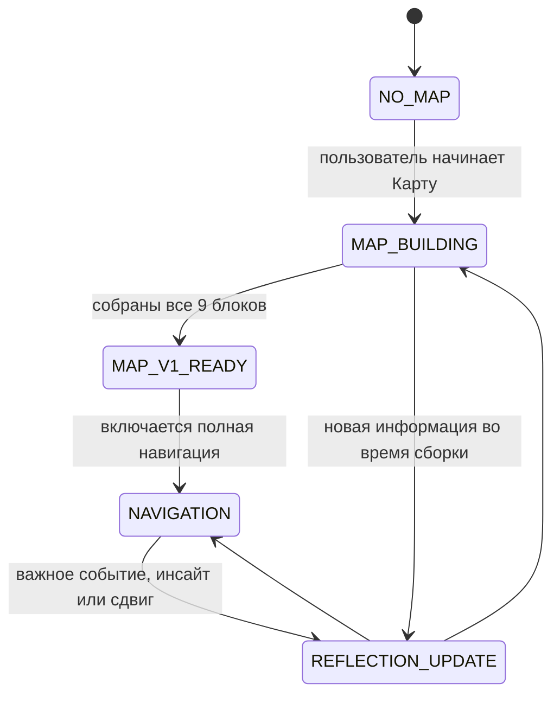

<p align="center">
  
</p>

# Personal Navigator

**Personal Navigator** — это персональный AI-навигатор, который сначала помогает человеку лучше понять себя, а потом использует это понимание для более честных и точных ответов.

Обычный AI может быстро дать совет, план или мотивационную фразу. Но если он не знает человека, его ценности, энергию, страхи, желания, опыт и текущий жизненный этап, такой ответ часто остаётся слишком общим. Personal Navigator работает иначе: он помогает собрать Карту личности, ведёт живую память развития и только потом начинает опираться на неё в решениях, рефлексии, целях, состояниях и сложных жизненных вопросах.

Я называю главный ориентир этой системы **внутренним Огнём** или **Живым Огнём**. Это не эзотерический термин. Так я называю состояние, когда человек снова чувствует: я живу свою жизнь, в удовольствии, в драйве, у меня есть энергия, смысл и движение в гармонии со своей природой. Каждый может назвать это по-своему. Важно не название, а само состояние.

Это не ещё один productivity-бот и не набор мотивационных промптов. Навигатор не пытается делать человека просто эффективнее. Он помогает человеку становиться яснее, свободнее, живее и ближе к собственной природе.

[English](README.en.md) · [Быстрый старт](docs/QUICKSTART.md) · [Инструкция установки](docs/INSTALLATION.md) · [GitHub Pages версия](docs/index.html)

Рекомендуемое имя GitHub-репозитория: `personal-navigator`. Устанавливаемый skill-пакет внутри репозитория называется `personal-navigator-skill/`.

## Зачем это нужно

Большинству людей не нужно больше информации. Им нужна ясность.

Обычный AI часто отвечает так, будто человек уже понятен: даёт советы, строит планы, предлагает техники. Но без глубокого знания человека такие ответы легко становятся красивыми словами в воздух. Они могут звучать разумно, но не учитывать ценности, энергию, зрелость, жизненный этап, ограничения, реальные желания и повторяющиеся паттерны.

Personal Navigator строится вокруг другой логики:

```text
не совет -> а понимание человека
не мотивация -> а ясность и опора
не универсальная рекомендация -> а навигация через Карту личности
не разовый ответ -> а живая память развития
```

Главная цель Навигатора — помочь человеку постепенно приближаться к жизни, которая соответствует его глубинной природе.

## Что такое Живой Огонь

В методологии Навигатора есть главный ориентир — **Живой Огонь**.

Это состояние, в котором:

- энергия возникает естественно;
- действия наполнены смыслом;
- решения совпадают с внутренними ценностями;
- способности реализуются;
- человек принимает ответственность за свою жизнь;
- жизнь ощущается живой и настоящей.

Навигатор не оптимизирует человека ради эффективности. Если рекомендация повышает продуктивность, но снижает живость, такая рекомендация считается ошибочной.

## Как это работает

Skill ведёт пользователя через несколько режимов:



### 1. Без Карты нет полной навигации

Если у пользователя ещё нет Карты личности, Навигатор честно говорит: полноценная персональная навигация пока невозможна. Он может помочь в моменте, но только с оговоркой, что ответ ограничен.

Это важная часть методологии. Агент не должен притворяться, что знает человека.

### 2. Карта собирается через дружеское интервью

Навигатор не выдаёт сухую анкету. Он ведёт диалог, задаёт по одному сильному вопросу за раз и вытаскивает реальные примеры, выборы, реакции, желания, страхи, ценности и повторяющиеся сценарии.

Вопросы задаются в контексте разговора. Иногда человек приходит не "собирать Карту", а с обычным запросом. Если для честного ответа не хватает данных, Навигатор задаёт недостающий вопрос, помогает с текущей ситуацией и одновременно пополняет Карту.

### 3. Сборка Карты уже даёт эффект

Сам процесс создания Карты — важная часть методологии. Простые вопросы часто оказываются глубокими: человеку приходится честно вспомнить реальные ситуации, выборы, энергию, повторяющиеся сценарии и то, что его действительно оживляет.

Навигатор не копирует прямые ответы в Карту. Он использует ответы как якоря, а затем делает аккуратную интерпретацию: соединяет факты, противоречия, ценности, энергию и паттерны в цельную картину личности. Поэтому готовая Карта должна читаться не как анкета, а как собранный по крупицам живой портрет человека.

### 4. После Карты начинается полная навигация

Когда все 9 блоков собраны до рабочей глубины, Навигатор может опираться на:

- Карту личности;
- текущий уровень энергии;
- жизненные обстоятельства;
- историю развития;
- незакрытые гипотезы;
- прошлые решения и повторяющиеся темы;
- научные модели как линзы, а не ярлыки;
- принципы из книг как внешний компас, а не догму.

## Пользовательский путь

После установки человеку не нужно самому разбираться, как "правильно" пользоваться Навигатором. Skill должен вести его через процесс.

1. **Первый контакт.** Навигатор объясняет, что для полноценной персональной навигации нужна Карта личности, и коротко показывает, зачем она нужна.
2. **Создание памяти.** Если файлов памяти ещё нет, Навигатор создаёт или предлагает сохранить `NAVIGATOR_STATE.md`, `PERSONALITY_MAP.md`, `DEVELOPMENT_JOURNAL.md` и `OPEN_LOOPS.md`.
3. **Дружеское интервью.** Навигатор начинает с простых человеческих вопросов. Это не анкета и не допрос: вопросы помогают человеку вспоминать реальные ситуации, замечать энергию, выборы, желания, ограничения и повторяющиеся темы.
4. **Прогресс без давления.** В процессе Навигатор мягко показывает, какие блоки Карты уже заполнены, какие ещё слабые и какой следующий вопрос поможет продвинуться.
5. **Помощь до полной Карты.** Если человек приходит с реальным запросом до завершения Карты, Навигатор не отказывает. Он честно говорит, что ответ будет ограниченным, задаёт недостающие вопросы и одновременно пополняет Карту.
6. **Первая Карта V1.** Когда 9 блоков собраны, Навигатор перечитывает материал, проверяет противоречия, переносит неопределённости в open loops и отдаёт первую цельную версию Карты. Пользователю важно прочитать её внимательно: сам момент чтения часто даёт сильную ясность и внутреннюю опору.
7. **Живая навигация.** После Карты начинается полноценная работа: решения, цели, состояния, Икигай, WOOP, рефлексия, обновление журнала и аккуратное развитие Карты по мере изменения человека.

Главный принцип: Навигатор должен помогать человеку проходить этот путь спокойно и интересно. Он не должен давить, торопить или превращать саморефлексию в тяжёлую обязанность.

## Карта личности

Карта личности — центральный инструмент системы. Она не является "истиной о человеке навсегда". Это живая модель, которая постоянно уточняется через диалог, наблюдение и рефлексию.

Карта состоит из 9 блоков:

| Блок | Что раскрывает |
| --- | --- |
| 1. Ядро личности | ценности, внутренние драйверы, совесть, тени, базовая стратегия |
| 2. Психо-энергетический профиль | что даёт энергию, что истощает, циклы, восстановление, среды |
| 3. Стихия Живого Огня | живость, игра, юмор, речь, свои и не свои люди |
| 4. Психотип и научные модели | MBTI, Big Five, HEXACO, Эннеаграмма и другие модели как приближения |
| 5. Способ действия | как человек принимает решения, двигается, ошибается и возвращается в силу |
| 6. Социальное Я | роли, отношения, границы, вклад, резонанс с людьми |
| 7. Опыт и капитал | навыки, достижения, ошибки, активы, накопленный жизненный материал |
| 8. Будущее и цели | направление, Икигай, сценарии, желания, ограничения, смысл |
| 9. Метрики личности и качества жизни | энергия, ясность, состояние, свобода, качество жизни, динамика роста |

Каждый блок хранится не как набор ярлыков, а как связка:

- **essence** — короткая суть от первого лица;
- **context** — факты, истории, ситуации, цитаты, реальные якоря;
- **structured synthesis** — аккуратная интерпретация без додумывания.

## Живая память

Навигатор работает не только с Картой. У него есть несколько файлов памяти:

```text
personal-navigator-skill/
  README.md
  SKILL.md
  references/
    core.md
    lifecycle.md
    map-structure.md
    interview-protocol.md
    navigation-modes.md
    memory-model.md
    update-protocol.md
    safety-boundaries.md
    language-and-platform.md
    principles-library.md
    validation-checklist.md
  templates/
    NAVIGATOR_STATE.md
    PERSONALITY_MAP.md
    DEVELOPMENT_JOURNAL.md
    OPEN_LOOPS.md
    supplements/
```

### `NAVIGATOR_STATE.md`

Показывает текущий статус: есть ли Карта, какие блоки закрыты, какой язык пользователя, где сейчас находится процесс.

### `PERSONALITY_MAP.md`

Главная Карта личности. Обновляется осторожно, только с опорой на реальные якоря. Если новая информация сильно противоречит старой, Навигатор должен переспросить пользователя.

### `DEVELOPMENT_JOURNAL.md`

Журнал развития. Он фиксирует важные события, инсайты, решения, изменения состояния и повторяющиеся темы. Это память о движении человека во времени.

### `OPEN_LOOPS.md`

Список гипотез, пробелов, противоречий и недостающих якорей. Если Навигатор чего-то не знает, он не придумывает. Он оставляет open loop и возвращается к нему позже.

### `supplements/`

Зона дополнительных слоёв. Например, отдельные доменные карты, профессиональный контекст или будущие необязательные источники вроде натальной карты. Это не ядро методологии.

## Архитектурные принципы

Personal Navigator построен на нескольких жёстких правилах:

- **Человек важнее Карты.** Если реальность противоречит старому описанию, исследуется реальность, а не защищается формулировка.
- **Карта обязательна для полной навигации.** Без неё возможна только ограниченная помощь.
- **Никакого додумывания.** Факты, интерпретации, гипотезы и пробелы должны различаться.
- **Один сильный вопрос за раз.** Сбор Карты идёт через живой диалог, а не через допрос.
- **Модели не являются ярлыками.** Типологии помогают смотреть, но не заменяют человека.
- **Обновления аккуратны.** Журнал обновляется свободнее, Карта — только при достаточной устойчивости и якорях.
- **Навигатор не создаёт зависимость.** Лучший результат — когда человек постепенно становится способнее быть собственным Навигатором.

## На чём основана методология

Система соединяет несколько уровней:

- реальность текущей ситуации;
- состояние, энергия и безопасность;
- зрелость, обстоятельства и жизненный этап;
- Карта личности;
- история развития;
- психологические и научные модели;
- Икигай как долгосрочный компас;
- WOOP как переход от понимания к действию;
- принципы из книг как проверочные ориентиры.

Модели вроде MBTI, Big Five, HEXACO, Эннеаграммы, SDT, Маслоу, Франкла, Канемана, Gallup и Cynefin используются только как линзы. Они не имеют права подменять реальность человека.

## Чем это отличается от обычного AI-коуча

| Обычный AI-коуч | Personal Navigator |
| --- | --- |
| отвечает сразу | сначала проверяет, хватает ли контекста |
| даёт универсальные советы | сверяет рекомендации с Картой личности |
| забывает развитие | ведёт журнал изменений и инсайтов |
| типирует человека | использует модели как приблизительные линзы |
| мотивирует действовать | проверяет энергию, готовность и следующий доступный шаг |
| звучит уверенно даже без данных | честно отмечает ограничения и open loops |

## Для кого это

Personal Navigator подойдёт людям, которые хотят:

- лучше понять себя без мистификации и без сухой диагностики;
- принимать решения, опираясь на свою природу, а не только на внешние ожидания;
- видеть, где уходит энергия и где появляется живость;
- собрать долгую AI-память о себе и своём развитии;
- работать с целями, состояниями, выбором, смыслом и повторяющимися сценариями;
- использовать AI не как генератор советов, а как честную систему ориентации.

Это особенно полезно тем, кто строит проекты, проходит жизненный переход, много думает о своём пути или чувствует, что обычные ответы уже не помогают.

## Для каких сред

Skill спроектирован как переносимая агентная методология. Сейчас в репозитории есть рабочая структура для Codex-style skills, но логика намеренно описана так, чтобы её можно было адаптировать под:

- Codex;
- Claude Code;
- Antigravity;
- OpenCode;
- Hermes;
- другие агентные среды, где есть инструкции, файлы памяти и возможность работать с пользовательским контекстом.

Платформа может отличаться. Методологическое ядро остаётся тем же: Карта, журнал, open loops, режимы навигации и аккуратное обновление памяти.

## Быстрый старт

Для Codex-подобной среды:

1. Поместите папку `personal-navigator-skill/` в директорию skills вашей среды.
2. Запустите диалог с явным намерением использовать skill.
3. Начните с создания Карты личности.

Для Codex это обычно выглядит так:

```bash
mkdir -p ~/.agents/skills
cp -R personal-navigator-skill ~/.agents/skills/
```

После активации skill создаёт в рабочем пространстве файлы памяти из шаблонов и начинает вести пользователя через Карту личности.

Первый пользовательский сценарий есть в [Быстром старте](docs/QUICKSTART.md).

Подробные инструкции для Codex, Claude Code, Antigravity, OpenCode, Windsurf/Cascade, GitHub Copilot/VS Code, Cursor и сред без нативной поддержки skills лежат в [docs/INSTALLATION.md](docs/INSTALLATION.md).

Пример первого запроса:

```text
Use $personal-navigator-skill.
Хочу начать собирать мою Карту личности. Веди меня через дружеское интервью.
```

Если Карта уже есть:

```text
Use $personal-navigator-skill.
У меня есть Карта личности. Помоги разобрать решение, но сначала проверь, хватает ли тебе контекста.
```

Если Карты ещё нет, но нужна помощь прямо сейчас:

```text
Use $personal-navigator-skill.
Карты пока нет, но мне нужно разобраться с текущей ситуацией. Дай ограниченную навигацию и задай недостающие вопросы.
```

## Авторская история

Проект создан Дмитрием Козюра, предпринимателем и автором методики Personal Navigator.

Идея родилась из личного опыта: после периода жизни "на скорости", бизнесовых сложностей и внутреннего кризиса Дмитрий начал использовать AI не для быстрых ответов, а для глубокой работы с собой. Он передал системе контекст своей жизни, разбирал паттерны, энергию, убеждения, желания и ошибки. Так появилась Карта личности, а затем Навигатор — AI-система, которая даёт рекомендации не абстрактно, а на основе глубокого понимания человека.

Сейчас эта методология упаковывается как open-source skill, чтобы другие люди могли создавать собственных Навигаторов и развивать подход вместе с сообществом.

Следить за обновлениями:

- Instagram: [@dmitry.kozyura](https://instagram.com/dmitry.kozyura)
- Telegram: [@dmitry_kozyura](https://t.me/dmitry_kozyura)

Поддержать и участвовать:

- поставить звезду на GitHub;
- открыть Issue, если будет найдена ошибка;
- написать идею или сценарий в Discussions.
- если Personal Navigator помог вам, упомянуть проект или автора, чтобы было видно, где методология приносит пользу.

Это поможет подключить больше людей, развивать методологию и внедрять улучшения вместе с сообществом.

## Важные границы

Personal Navigator не является терапией, медицинской диагностикой, юридической или финансовой консультацией. Он не должен ставить диагнозы, заменять специалиста или давать опасные рекомендации.

Его зона — ясность, рефлексия, структура, персональная навигация, развитие и честное движение к более живой жизни.

## Статус проекта

Текущий репозиторий содержит первую рабочую версию skill и публичной документации:

- ядро методологии;
- lifecycle/state machine;
- структуру Карты из 9 блоков;
- протокол интервью;
- модель памяти;
- протокол обновлений;
- режимы навигации;
- safety boundaries;
- шаблоны файлов памяти;
- русскую и английскую README-страницы;
- инструкции установки для популярных агентных сред;
- базовую GitHub Pages страницу.

Дальше планируется:

- собрать примеры реальных сценариев;
- развивать методологию и сценарии через обратную связь сообщества.

## Лицензия и атрибуция

Проект опубликован под лицензией [MIT](LICENSE). Вы можете использовать, адаптировать и распространять Personal Navigator свободно.

Если методология помогает вам или вашему проекту, пожалуйста, сохраняйте упоминание Дмитрия Козюра и делитесь обратной связью через Issues или Discussions. Это помогает понимать, где skill реально приносит пользу, и улучшать его дальше.

## Главная формула

```text
Карта личности + живая память + честные вопросы + бережное обновление
= AI-навигация, которая помогает человеку становиться яснее, свободнее и живее.
```
